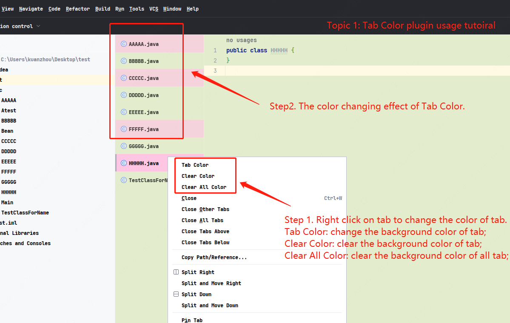
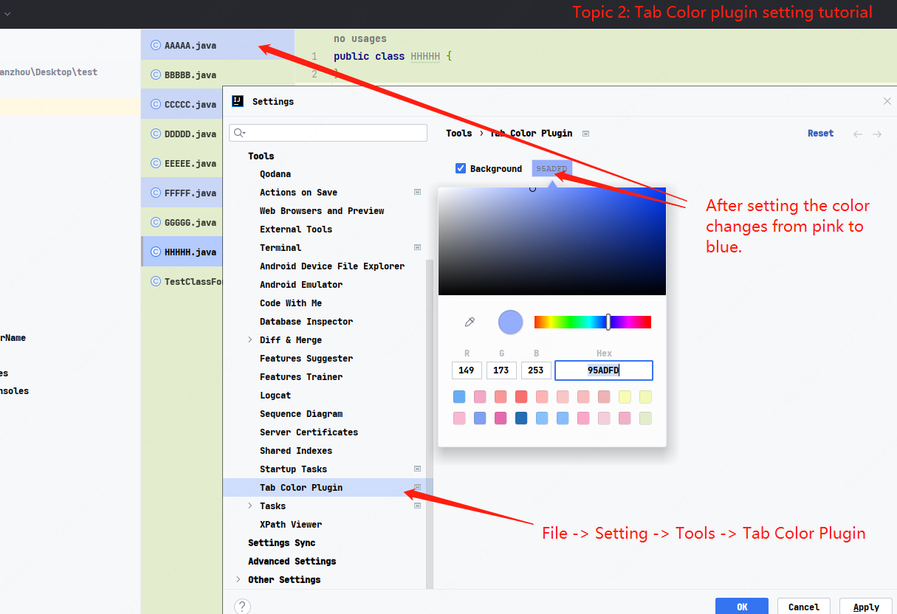

# TabColor

This is an IDEA plugin. By changing the color of core Tabs, developers are freed from the confusion of a bunch of Tabs!

## Installation
1. In the IDEA plugin installation interface, search for TabColor and install it.
2. Download the plugin installation package from the browser and install it locally. download link: [https://plugins.jetbrains.com/plugin/22920-tabcolor](https://plugins.jetbrains.com/plugin/22920-tabcolor)
3. Download the latest version installation package of this github repository release, and then install it locally.

## Tutorial

#### Plugin usage
1. Right-click any of your Tabs, and the top three options are the functions provided by this plugin.
+ Tab Color：Color the selected label.
+ Clear Tab Color：Clear the color of the selected label.
+ Clear all Color：Clear the color of all selected tags.

In addition, you can see that the currently active tab color will be brighter than the normal tab color that is set.

#### Plugin setting

If you feel that the initial color (pink) does not meet your aesthetic preferences, you can set it by:   
> **File -> Seting -> Tools -> Tab Color Plugin**   

Set the default color for this plugin.

## Source Code Environment
IDEA 2020.2.4, JDK 18, Gradle 7.5
