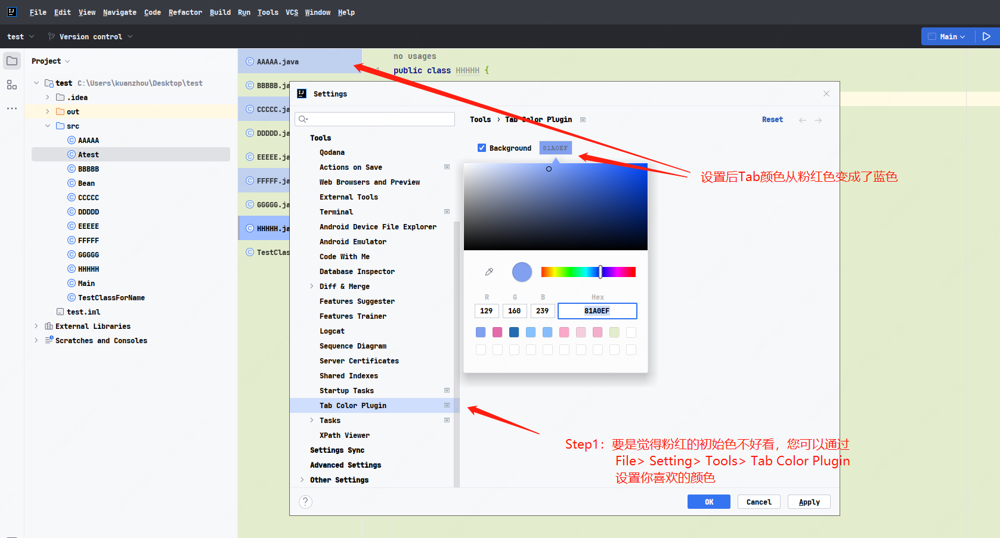
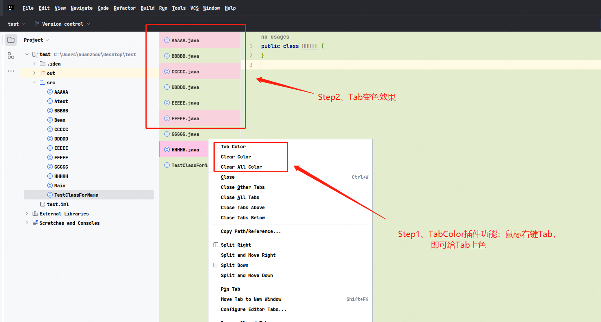

# TabColor

这是一个IDEA插件。通过改变核心Tab的颜色，将开发者从一堆Tab的迷茫中解放！

## 安装
1. IDEA插件安装界面，搜索TabColor，进行安装。
2. 从浏览器下载插件安装包，然后从本地安装。下载地址：[https://plugins.jetbrains.com/plugin/22920-tabcolor](https://plugins.jetbrains.com/plugin/22920-tabcolor)
3. 下载本github仓库release最新版本安装包，然后从本地安装。

## 使用教程

#### 插件使用
右键您任意一个Tab，最上面三个选项，即是本插件提供的功能。
+ Tab Color：给选中标签上色。
+ Clear Tab Color：清除选中标签的颜色。
+ Clear all Color：清除所有选中标签的颜色。

另外，您可以看到当前的活跃标签颜色，会比普通被设置标签颜色更加鲜亮。

#### 插件设置

如果您觉得初始颜色（粉红）不符合您的审美，您可以通过设置，即：  
>**File -> Seting -> Tools -> Tab Color Plugin**

设置本插件的默认颜色。

## 源码环境
IDEA 2020.2.4、JDK 18、Gradle 7.5
